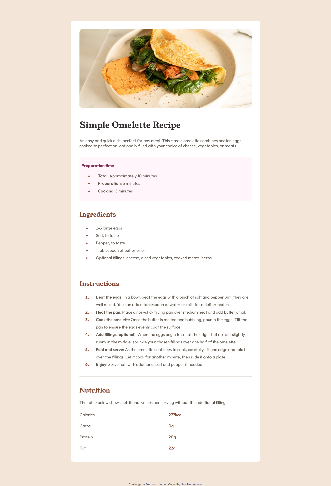

# Frontend Mentor - Recipe page solution

This is a solution to the [Recipe page challenge on Frontend Mentor](https://www.frontendmentor.io/challenges/recipe-page-KiTsR8QQKm).

## Table of contents

- [Overview](#overview)
  - [The challenge](#the-challenge)
  - [Screenshot](#screenshot)
  - [Links](#links)
- [My process](#my-process)
  - [Built with](#built-with)
  - [Useful resources](#useful-resources)

## Overview

### Screenshot

### Links

- Solution URL: [gihub](https://github.com/darkquail/recipe-page)
- Live Site URL: [live-preview](https://darkquail.github.io/darkquail/recipe-page/index)

## My process

### Built with

- Semantic HTML5 markup
- CSS custom properties
- CSS Grid

### Useful resources

- [css tricks about the gap after the list marker](hhttps://css-tricks.com/everything-you-need-to-know-about-the-gap-after-the-list-marker/) 

- [Sticky Footer](https://css-tricks.com/couple-takes-sticky-footer/)